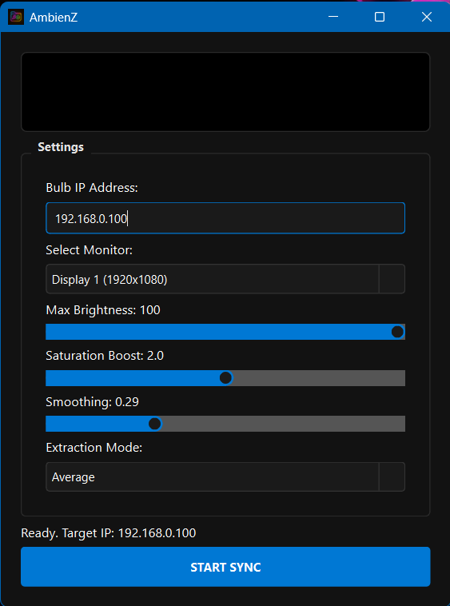

<div align="center">

# 💡 AmbienZ

### Real-Time Screen-to-WiZ Ambient Lighting Sync

**A sleek desktop app that captures your screen colors and syncs them live to WiZ smart bulbs over your local network — no cloud, no account, zero latency.**

[](https://www.python.org/)
[](https://doc.qt.io/qtforpython/)
[](LICENSE)
[]()
[](https://github.com/ishendrarai/AmbienZ/actions)\

[Features](#-features) · [Requirements](#-requirements) · [Installation](#-installation) · [Usage](#-usage) · [Configuration](#-configuration) · [Troubleshooting](#-troubleshooting) · [Changelog](CHANGELOG.md)


---



</div>

---

## ✨ Features

| Feature                          | Description                                                                        |
| -------------------------------- | ---------------------------------------------------------------------------------- |
| 🎨 **3 Color Algorithms**        | Histogram Dominant, Average, and Edge-Weighted color extraction                    |
| 🌊 **Adaptive Smoothing**        | Configurable exponential smoothing to prevent jarring flicker                      |
| 💡 **Multi-Bulb Sync**           | Add multiple WiZ bulb IPs — all receive the same color simultaneously              |
| 🎮 **Adjustable FPS**            | Slider to control capture rate from 10 to 60 FPS                                  |
| 🎛️ **Gamma Correction**          | Per-session gamma slider (0.8–2.2) for accurate perceptual brightness              |
| 🌡️ **Color Temperature**         | Kelvin slider (1 000–20 000 K) adjusts the white-point in linear RGB space        |
| ⚡ **Frame-Skip Optimisation**   | Skips UDP sends when color change is below threshold — reduces flicker             |
| 🖥️ **Dark Modern UI**            | PySide6 GUI with live color preview, status dot, and real-time RGB readout         |
| 🖥️ **Multi-Monitor**             | Select which display to capture from a dropdown                                    |
| 💡 **Brightness Control**        | Adjustable max brightness sent directly to the bulb                                |
| 🔔 **System Tray**               | Minimize to tray and run silently in the background                                |
| 💾 **Config Persistence**        | All settings auto-saved/loaded from `ambienz_config.json`                          |

---

## 📋 Requirements

> ⚠️ **Platform support:** Fully supported on **Windows 10/11**. macOS and Linux are experimental — some features (e.g. system tray, screen capture backend) may behave differently.

- **Python** 3.10 or higher
- **WiZ smart bulb(s)** connected to your local Wi-Fi network
- Windows 10/11 (primary), macOS, or Linux

---

## 🚀 Installation

### 1. Clone the repository

```bash
git clone https://github.com/ishendrarai/AmbienZ.git
cd AmbienZ
```

### 2. Create a virtual environment and install dependencies

```bash
python -m venv .venv
# Windows:
.venv\Scripts\activate
# macOS/Linux:
source .venv/bin/activate

pip install -r requirements.txt
```

> A `requirements.txt` is included with pinned versions of all dependencies (`PySide6`, `mss`, `opencv-python`, `numpy`) to ensure reproducible installs.

### 3. Run

```bash
python AmbienZ.py
```

---

## 🖱️ Usage

### First-time setup

1. **Add your bulb(s)** — Type the IP address of each WiZ bulb into the **Bulbs** field and click **+ Add** (e.g. `192.168.0.100`). Repeat for every bulb you want to sync.
2. **Select your monitor** — Pick the display you want to capture from the dropdown.
3. **Tune your settings** — Adjust FPS, brightness, saturation, gamma, color temperature, smoothing, and extraction mode.
4. **Click START SYNC** — All bulbs will immediately begin mirroring your screen.

### Controls overview

| Control               | What it does                                                                           |
| --------------------- | -------------------------------------------------------------------------------------- |
| **Bulbs list**        | Add or remove WiZ bulb IPs. All listed bulbs receive every color update.               |
| **Select Monitor**    | Choose which display to capture (all connected monitors listed)                        |
| **FPS**               | Sets how many frames per second the sync loop targets (10–60)                          |
| **Max Brightness**    | Sets the `dimming` value sent to the bulb (10–100%)                                    |
| **Saturation Boost**  | Multiplies color saturation for more vivid output (1.0–3.0×)                           |
| **Gamma**             | Gamma correction exponent applied in linear RGB space (0.8–2.2)                        |
| **Color Temp**        | White-point adjustment in Kelvin (1 000 K = warm amber · 6 500 K = neutral · 20 000 K = cool blue) |
| **Smoothing**         | Controls temporal smoothing between frames (0 = instant, 0.99 = very slow)             |
| **Extraction Mode**   | Algorithm used to pick the screen color                                                |
| **START / STOP SYNC** | Toggle the live sync loop on or off                                                    |

---

## 🎨 Color Extraction Modes

### Dominant (Histogram)

Quantises pixels into an 8×8×8 color bin grid and returns the center of the most-populated non-dark bin. Significantly faster than KMeans with comparable color accuracy — best for movies and games with distinct color regions.

### Average

Simple mean of all pixels in the captured frame. Lowest CPU usage — ideal if performance is a priority.

### Edge Weighted

Weights pixels near the edges and borders of the screen more heavily. Great for content where the action sits at the frame edges (widescreen cinema, racing games).

---

## ⚙️ Configuration

Settings are auto-saved to `ambienz_config.json` next to `AmbienZ.py` whenever the app closes, and loaded automatically on next launch.

| Key           | Description                                                                            |
| ------------- | -------------------------------------------------------------------------------------- |
| `bulb_ips`    | List of WiZ bulb IP addresses                                                          |
| `fps`         | Target capture framerate (10–60)                                                       |
| `monitor_idx` | Index of the monitor to capture (1 = primary)                                          |
| `brightness`  | Max brightness value sent to bulb (10–100)                                             |
| `saturation`  | Saturation multiplier (stored as slider integer, divided by 10 on use)                 |
| `smoothness`  | Smoothing factor (stored as 0–99, divided by 100 on use)                               |
| `gamma`       | Gamma exponent (stored as slider integer, divided by 10 on use)                        |
| `kelvin`      | Color temperature in Kelvin (1 000–20 000). Stored and used as-is. Default: 6 500 K   |
| `mode`        | Extraction algorithm: `Dominant`, `Average`, or `Edge Weighted`                        |

### Example `ambienz_config.json`

```json
{
  "bulb_ips": ["192.168.0.100"],
  "monitor_idx": 1,
  "fps": 40,
  "brightness": 100,
  "saturation": 14,
  "smoothness": 60,
  "gamma": 10,
  "kelvin": 6500,
  "mode": "Dominant"
}
```

---

## 🧠 How It Works

AmbienZ runs a high-frequency capture loop in a background QThread:

```
Screen Frame (mss)
      │
      ▼
Resize to 160×90          (fast, low-memory processing)
      │
      ▼
Crop black bars           (threshold-based edge detection)
      │
      ▼
Color extraction          (Histogram Dominant / Average / Edge Weighted)
      │
      ▼
Linear RGB conversion     (sRGB → linear, γ=2.2)
      │
      ▼
Gamma correction          (user-adjustable exponent, 0.8–2.2)
      │
      ▼
Saturation boost          (scaled in linear RGB space)
      │
      ▼
Color temperature         (Kelvin white-point via Tanner Helland piecewise fit,
                           normalised to D65 / 6 500 K, applied in linear light)
      │
      ▼
Exponential smoothing     (blends current frame with previous)
      │
      ▼
Frame-skip check          (skip if Δcolor < threshold)
      │
      ▼
UDP → WiZ Bulb(s)         (setPilot JSON over port 38899, all IPs)
```

The WiZ protocol is a simple JSON-over-UDP API on port `38899`. No cloud required.

### Color Temperature module (`color_temperature.py`)

The standalone `color_temperature.py` module provides the white-point math:

- **`kelvin_to_multipliers(kelvin)`** — returns `(r_mul, g_mul, b_mul)` normalised to 1.0 at 6 500 K (D65). Used directly by the sync loop.
- **`adjust_color_temperature(image, kelvin)`** — full image adjustment pipeline with gamma encode/decode. Useful for batch processing.
- **`build_kelvin_lut()`** / **`lut_lookup()`** — pre-computed LUT with linear interpolation for tight loops.

---

## 🔔 System Tray

Minimizing the window hides AmbienZ to the system tray — sync continues running in the background. A notification confirms it's still active.

- **Double-click** the tray icon to restore the window
- **Right-click** for a menu with _Show Settings_ and _Quit AmbienZ_

---

## 🛠️ Troubleshooting

| Problem                     | Solution                                                                       |
| --------------------------- | ------------------------------------------------------------------------------ |
| Bulb not responding         | Confirm the bulb and PC are on the same Wi-Fi network and the IP is correct    |
| Wrong IP entered            | Find the correct IP using the WiZ app or your router's device list (see below) |
| High CPU usage              | Switch to **Average** mode, or lower the **FPS** slider                        |
| Colors feel washed out      | Increase **Saturation Boost** (try 2.0–2.5×)                                   |
| Too much flickering         | Increase **Smoothing** toward 0.9                                              |
| Slow / laggy response       | Lower **Smoothing** to 0.2–0.4, or raise **FPS**                               |
| Colors too dark/bright      | Adjust the **Gamma** slider — lower values brighten, higher values darken      |
| Bulb looks too warm/cool    | Use the **Color Temp** slider — 6 500 K is neutral daylight; decrease for warmer amber tones, increase for cooler blue tones |
| Monitor not listed          | Reconnect the display and restart the app                                      |
| Settings not saved          | Ensure the app is closed normally (not force-quit)                             |
| `color_temperature` import error | Ensure `color_temperature.py` is in the same folder as `AmbienZ.py`      |

---

## 📡 Finding Your Bulb's IP

### Option 1 — WiZ mobile app _(easiest)_

`App → Device → Settings → Device Info → IP Address`

### Option 2 — Router admin panel

Log into your router (usually `192.168.0.1` or `192.168.1.1`) and look for a device named **WiZ** or **ESP** in the connected devices list.

### Option 3 — ARP table (Windows)

If the bulb is already on your network, open Command Prompt and run:

```
arp -a
```

Look for an entry with a MAC address starting with `d8:a0:1d` or `a8:bb:50` — these are common WiZ/Espressif prefixes.

### Option 4 — Network scanner

Use [Advanced IP Scanner](https://www.advanced-ip-scanner.com/) (Windows) or run:

```bash
nmap -sn 192.168.0.0/24
```

Replace `192.168.0.0/24` with your actual subnet if different (e.g. `192.168.1.0/24`).

Once you have the IP, enter it into the **Bulbs** field and click **+ Add**.

---

## 🖥️ Finding Your PC's IP Address

Your PC and the WiZ bulb must be on the **same local network** (same router/Wi-Fi). Use your PC's IP to confirm this — both should share the same first three octets (e.g. `192.168.0.x`).

### Windows

```
ipconfig
```

Look for **IPv4 Address** under your active network adapter (Wi-Fi or Ethernet).

### macOS

```bash
ipconfig getifaddr en0
```

Use `en1` instead if you're on Ethernet.

### Linux

```bash
ip a
```

Look for `inet` under your active interface (e.g. `wlan0` or `eth0`).

> **Example:** If your PC's IP is `192.168.0.50` and your bulb's IP is `192.168.0.100`, you're on the same subnet — everything should work. If they don't share the first three octets, check that both devices are connected to the same router.

---

## 🤝 Contributing

Contributions are welcome!

### Setting up for development

```bash
git clone https://github.com/ishendrarai/AmbienZ.git
cd AmbienZ
python -m venv .venv && source .venv/bin/activate   # Windows: .venv\Scripts\activate
pip install -r requirements.txt
python AmbienZ.py   # verify the app launches correctly before making changes
```

### Workflow

1. **Open an issue first** — describe the bug or feature before writing code, so we can discuss approach
2. Fork the repository
3. Create a feature branch: `git checkout -b feature/your-feature-name`
4. Make your changes and test them manually
5. Format your code with [Black](https://black.readthedocs.io/): `black .`
6. Commit: `git commit -m "Add your feature"`
7. Push: `git push origin feature/your-feature-name`
8. Open a Pull Request with a clear description of what changed and why

### Code style

- **Formatter:** [Black](https://black.readthedocs.io/) (default settings)
- **Naming:** `snake_case` for variables and functions, `PascalCase` for Qt widget subclasses
- Keep UI logic in the `MainWindow` class; keep color math in dedicated modules

### Ideas for contributions

- [ ] Kalman filter for temporal stabilization
- [ ] Scene presets (Movie / Gaming / Music / Ambient)
- [ ] Custom screen region selector (drag-to-select)
- [ ] Audio reactive mode (mic input → color)
- [ ] Explicit bulb off-command when screen goes dark
- [ ] WLED / Govee / Tapo protocol support

---

## 📄 License

This project is licensed under the **MIT License** — see the [LICENSE](LICENSE) file for details.

---

## 🙏 Acknowledgements

- [pywizlight](https://github.com/sbidy/pywizlight) — WiZ UDP protocol reference
- [mss](https://github.com/BoboTiG/python-mss) — Fast cross-platform screen capture
- [OpenCV](https://opencv.org/) — Image processing
- [PySide6 / Qt](https://doc.qt.io/qtforpython/) — GUI framework
- [Tanner Helland](https://tannerhelland.com/2012/09/18/convert-temperature-rgb-algorithm-code.html) — Kelvin → RGB piecewise approximation

---

Made with ❤️ for smart home enthusiasts

⭐ **Star this repo if you find it useful!**
